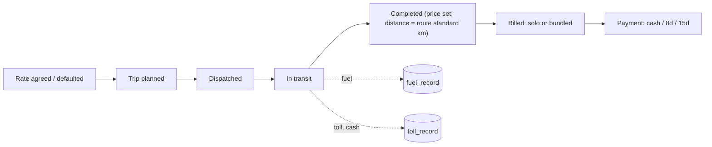
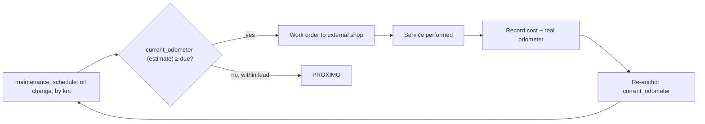

# Discovery — "Cómo cambiar tu negocio de transporte"

**Status:** Owner answered all 28 questions on 2026-09-10; folded in below. Still DRAFT
— the ~10 follow-up data questions in §L.2 remain open, and this document awaits your
final validation before the physical ERD is produced.
**Owner agent:** `BusinessAnalystAgent`. Financial detail in
[`docs/finance/financial-model.md`](../finance/financial-model.md); entities/ERD in
[`docs/database/conceptual-model.md`](../database/conceptual-model.md); the three
non-obvious calls made from these answers are recorded as decisions:
[0001](../decisions/0001-overhead-allocation-method.md) (overhead allocation),
[0002](../decisions/0002-trip-distance-source.md) (trip distance without odometer),
[0003](../decisions/0003-weekly-reporting-period.md) (weekly period).

---

## A. Business analysis

A road-freight company runs **6 dry-van (*furgón seco*) trucks and 1 pick-up** (7
powered units, no trailers) hauling loads for customers at a **flat rate per trip**,
against costs for fuel, tolls, external maintenance, tires, per-truck fixed costs
(insurance, permits, *fumigación*, *dekra*, *marchamo*) and company overhead (salaries,
administrative salaries, social charges — including driver pay, see below).

**Problem.** Nothing today ties trips, fuel, tolls and maintenance to the financial
side (invoices, payments, fixed costs) at the truck level, so the owner cannot say
which trucks are profitable. Overhead has **never been measured**; that is explicitly
part of what this system must do.

**Solution.** Capture the operational and commercial events, compute cost and
profitability at any grain (trip, route, customer, truck, fleet) for the owner's
**weekly** reporting cycle (ADR 0003), show it on a dashboard, and make every number
traceable to its source records.

### Actors

| Actor | Role |
|---|---|
| Owner | Consumes the dashboard; pricing & fleet decisions |
| Secretary | Data entry: trips, invoices, payments |
| Owner's wife, owner's son | Additional users — role TBD (§L.2) |
| Drivers | Source of trip events; not system users; paid hourly, change per trip |
| External workshops | Perform all maintenance (no in-house shop) |

### Scope

- **In:** cost accounting for 7 units; trip / route / customer / truck profitability;
  preventive (oil change, by km — estimated, see ADR 0002) + corrective maintenance
  with status; fuel & toll capture (manual); truck-fixed cost registry; overhead
  capture + activity-based allocation (ADR 0001); mixed invoicing (per-trip or
  bundled); payment tracking against 0/8/15-day terms; weekly KPI dashboard with
  drill-through.
- **Out (MVP):** depreciation / capital cost (owner: omit — see §A note below);
  trailer tracking (none exist); telematics/GPS; route optimisation; driver payroll
  processing beyond capturing hours × rate; full double-entry accounting/tax filing;
  fuel-card or toll-tag integrations (not used); customer portal.
- **Later:** n8n import of fuel-station statements (obtainable on request); per-trip
  odometer capture if the company adopts it; hybrid overhead pools; historical data
  migration (2 years, from spreadsheets/paper).

### Confirmed facts that replace earlier assumptions

| Topic | Confirmed |
|---|---|
| Pricing | Flat rate per trip; no fuel/waiting/stop surcharges mentioned (confirm in §L.2) |
| Revenue recognition | At **trip completion** |
| Rate agreements | Exist for some customers but vary — trip price is authoritative, agreement is a default only |
| Invoicing | **Mixed**: some invoices bundle several trips, others are one trip = one invoice |
| Payment terms | Cash on delivery, 8-day credit, or 15-day credit (varies by customer); **15-day accounts run ~8 days late** in practice |
| Currency / tax | Colones (CRC); IVA **13%** flat |
| Fleet | 6 dry-van trucks + 1 pick-up = 7 units; **no trailers** |
| Ownership | 4 owned, 2 financed — financing terms **not tracked** (explicitly deferred) |
| Capital cost | **Omitted** — no depreciation, no financing cost in the cost model |
| Driver assignment | Changes per trip (not fixed to a truck) |
| Driver pay | **Hourly**, based on daily hours worked; **not** attributable to a trip or truck → treated as part of the **overhead pool** (ADR 0001) |
| Truck-specific fixed costs | Insurance (theft & rollover), permits, *fumigación* (quarterly), *dekra* (annual inspection), *marchamo* (annual circulation tax) |
| Company overhead | Employee salaries, administrative salaries, social charges (*cargas sociales*) — total currently **unknown**, the system must capture it |
| Overhead allocation | By truck, weighted by **activity performed** (ADR 0001: worked-days share, default) |
| Fuel | Retail stations; account statements obtainable on request (future n8n import) |
| Tolls | Cash only, no electronic tag, no statements — manual entry |
| Odometer | **Not recorded at all** today (ADR 0002: distance defaults to route standard km) |
| Availability | Only **breakdowns/corrective** downtime counts against it; planned/preventive service does not |
| Utilization | Worked days ÷ available days |
| Preventive maintenance | Only defined interval is **oil change, by kilometres** (value TBD, §L.2); all work is done by **external** workshops |
| Tires | Tracked by position, rotated, replaced on visible wear — no serials or km today |
| Reporting period | **Weekly**, reported every Thursday (ADR 0003) |
| Historical data | ~2 years, in spreadsheets and paper |
| Users | ~4: owner, secretary, owner's wife, owner's son |
| Rollout | All 7 units from the start; no fixed production date; **target: finished before end of 2026** |

---

## B. Process map

### B.1 Trip lifecycle

Rate agreed (or defaulted from a rate agreement) → trip planned (truck + driver +
route + date) → dispatched → in transit (fuel, tolls, incidents recorded) → completed
(price confirmed; **no odometer captured** — distance = route standard km, ADR 0002)
→ billed, alone or bundled with other trips (mixed per owner) → paid (cash / 8-day /
15-day, often ~8 days late on 15-day accounts).

### B.2 Fuel event

Driver refuels at a **retail station** → litres, price, station, payment method
recorded → linked to truck (+ trip if known). Statements can be requested from
stations — candidate for a later n8n import.

### B.3 Toll event

Paid in **cash**, no tag, no statement → manually recorded: truck, trip (if known),
amount, location.

### B.4 Preventive maintenance (oil change only, for now)

The only defined interval is **oil change by kilometres**. Because there is no
odometer, the due point is tracked against `trucks.current_odometer`, an **estimate**
maintained from route-km accumulation and re-anchored by the odometer the **external
workshop** records at every service (ADR 0002).

### B.5 Corrective maintenance

Breakdown reported → truck out of service (**this counts against availability**) →
repaired by an external workshop → cost and downtime recorded → back in service.

### B.6 Tire management

Tires are **rotated by position** and **replaced when visibly worn** (tread lines) —
no serial numbers or kilometres tracked today. Modelled as position-based mount /
rotate / dismount events so history exists even without exact wear metrics.

### B.7 Cost registry

- **Truck-fixed** (direct to a truck, various billing cycles): insurance
  (theft/rollover), permits, *fumigación* (quarterly), *dekra* (annual), *marchamo*
  (annual). Prorated to the weekly period (ADR 0003).
- **Overhead** (company-wide, currently unmeasured): all salaries (including driver
  hours × rate) + social charges. Captured weekly, allocated by activity (ADR 0001).

### B.8 Invoicing & collection

Trips are billed **individually or bundled**, per the owner's own mixed practice.
Payment terms are cash / 8 days / 15 days per customer; 15-day accounts are tracked
against their ~8-day typical slippage for collections follow-up.

### B.9 Weekly KPI computation

Every **Thursday**, the system aggregates the trailing week (and, on demand, any
custom or calendar-month range) into the KPI set
([finance doc §K](../finance/financial-model.md#k-kpis)), with drill-through to source
rows.

---

## C. Data we must collect

Updated from the generic list to reflect what actually exists. Attribute-level detail
in [`docs/database/conceptual-model.md`](../database/conceptual-model.md) §H.

- **Truck (7 units):** plate, type (*furgón seco* ×6, pick-up ×1), ownership
  (owned/financed — financing terms not tracked yet), current-odometer **estimate**.
- **Driver:** identity, hourly rate, licence info; **daily hours worked** (new:
  `driver_worklogs`) to size the overhead driver-labour pool.
- **Customer:** identity, credit terms (0 / 8 / 15 days), billing preference
  (per-trip vs bundled — informational, not enforced).
- **Route:** origin, destination, **standard km** (now load-bearing — it is the only
  distance source, ADR 0002), typical toll cost.
- **Trip:** truck, driver, route, dates, price (flat), invoice link, distance flag
  (estimated vs manual override).
- **Fuel record:** truck, trip?, station (new lookup `fuel_stations`), litres, price,
  total, payment method.
- **Toll record:** truck, trip?, amount, cash only.
- **Maintenance:** truck, type (preventive/corrective), external provider (required —
  no in-house option), cost breakdown, **odometer at service** (re-anchors the
  estimate), downtime (only corrective counts against availability).
- **Maintenance schedule:** currently just "oil change" per truck, interval in km
  (value pending, §L.2).
- **Tire:** position-based events (mount/rotate/dismount on visible wear); serial and
  km optional.
- **Truck fixed cost:** type (seguro, permisos, fumigación, dekra, marchamo), amount,
  billing cycle (monthly/quarterly/annual), effective dates.
- **Overhead cost:** type (salarios, salarios administrativos, cargas sociales, …),
  amount, period — captured weekly or prorated from a longer cycle.
- **Driver worklog (new):** driver, date, hours worked, hourly rate → drives the
  overhead labour pool.
- **Invoice:** customer, trips covered (one or many), currency CRC, IVA 13%, status.
- **Payment:** invoice, date, amount, method.
- **User:** identity, role (owner/admin, admin/data-entry, viewer — see §L.2).

---

## D. Missing data

### D.1 Resolved by the owner (2026-09-10)

Pricing basis, revenue recognition point, rate-agreement existence, invoice bundling
practice, payment terms & typical delay, currency & tax rate, fleet size/composition,
trailer existence, ownership split, depreciation treatment, driver assignment pattern,
driver pay scheme & attributability, fixed-vs-overhead cost classification, overhead
size (unknown — to be captured, not estimated), overhead allocation preference, fuel
sourcing, toll method, odometer practice (none), availability definition, utilization
definition, preventive-maintenance basis (km, oil change only), maintenance provider
model (external only), tire tracking method, reporting period (weekly), historical
data depth (2 years) and source (spreadsheets/paper), users (4, named roles pending),
pilot scope (all units) and target (before end of 2026).

### D.2 Still needed (blocks seeding, not the schema)

Items 1, 2, 5–10 of the original list here were answered 2026-09-11 — see §L.2 below.
Two remain open:

1. Per-truck **fixed-cost amounts and billing cycle** for: seguro, permisos,
   fumigación, dekra, marchamo.
2. The **route list** with standard km (and typical toll cost) per route. **Partially
   advanced**: `Viajes.docx` gave the weekly route/stop schedule, extracted and analysed
   in [`docs/business/routes-inventory.md`](routes-inventory.md) — 19 recurring
   day-of-week routes across schools/CEN-CINAI, supermarkets, and police delegations.
   It does **not** give kilometres; the owner and the user will measure `standard_km`
   manually. `routes` stays unseeded until that column can be filled (ADR 0002 requires
   it non-null).

---

## I. Business rules

Formulas are in [`docs/finance/financial-model.md`](../finance/financial-model.md).

### Trips & distance (ADR 0002)

- `trip.distance = route.standard_km` unless a manual override is entered;
  `distance_estimated = true` whenever the route default was used.
- A route with no `standard_km` blocks its trips from per-km aggregates until set.
- A trip cannot be **completed** without: route (or manual origin/destination + a
  distance value), actual end datetime, and a price.

### Maintenance status (oil change only, for now)

- `VENCIDO` if `trucks.current_odometer (estimate) ≥ next_due_odometer`.
- `PROXIMO` if within a configurable `lead_km` of the due odometer.
- `AL_DIA` otherwise.
- Every service visit records the **real odometer**, which re-anchors the estimate for
  that truck (ADR 0002).

### Availability & utilization

- `availability(t,P) = (period_days − corrective_downtime_days) / period_days`.
  **Only breakdowns/corrective repairs count**; planned/preventive service does not.
- `utilization(t,P) = worked_days(t,P) / available_days(t,P)`, both counted within the
  weekly window by default (ADR 0003).

### Invoicing & revenue

- `invoice.total = subtotal + (subtotal × 0.13)` (IVA, pending §D.2 #10 on exemptions).
- An invoice may cover **one or several** trips (mixed practice); a trip is billed on
  exactly one invoice.
- Status derived: `paid` / `overdue` (past due_date, unpaid) / `partial`.
- Revenue is recognised at **trip completion**, independent of invoice or payment timing.

### Cost attribution (ADR 0001)

- **Direct cost of a trip** = fuel + tolls + trip-linked expenses. Driver pay is
  **not** included here (it is hourly and not trip-attributable).
- **Truck period cost** = direct costs + that truck's own maintenance & tire wear +
  its truck-fixed costs (prorated, ADR 0003) + its allocated share of overhead
  (worked-days weighted, ADR 0001). **No depreciation, no financing cost.**
- Overhead includes the driver-labour pool (`Σ driver_worklogs.hours × rate`).
- The allocation method and per-truck weights are persisted per period
  (`fixed_cost_allocations`) for auditability.

### Data integrity & traceability

- No hard delete of a truck, driver or customer with historical trips.
- Every KPI figure resolves to the exact source-row ids that produced it.
- All monetary values `DECIMAL`; currency CRC; rounding (half-up, 2 dp) only at
  presentation.
- Lookups (cost types, providers, stations) — no free text on reportable dimensions.
- Every transactional row records `created_by` and timestamps.

---

## L. Questions for the company owner

### L.1 Answered 2026-09-10

| # | Question | Answer |
|---|---|---|
| 1 | Pricing basis / surcharges | Flat rate |
| 2 | Revenue recognition point | Trip completed |
| 3 | Written rate agreements | Yes, but they vary |
| 4 | Invoice bundling | Mixed — some bundled, some per trip |
| 5 | Payment terms / typical delay | Cash / 8d / 15d; 15d runs ~8 days late |
| 6 | Fleet size/type | 6 dry-van trucks + 1 pick-up |
| 7 | Trailers | None |
| 8 | Ownership / financing payment | 4 owned, 2 financed; payment not tracked (pending) |
| 9 | Depreciation | Omit |
| 10 | Driver–truck pattern | Changes per trip |
| 11 | Driver pay scheme | Hourly |
| 12 | Driver cost attributable? | No — general cost, by daily hours |
| 13 | Fixed cost classification | Per truck: seguro, permisos, fumigación, dekra, marchamo, (cambios de aceite / llantas / peajes are modelled elsewhere). Company: salarios, salarios administrativos, cargas sociales |
| 14 | Overhead total | Unknown — the system must capture it |
| 15 | Planned service vs availability | Only breakdowns count |
| 16 | Utilization definition | Worked days vs available days |
| 17 | Overhead allocation preference | By truck and activity performed |
| 18 | Fuel sourcing | Retail stations; statements requestable |
| 19 | Tolls | Cash, no tag, not exportable |
| 20 | Odometer capture | None |
| 21 | Preventive intervals | Oil change, by km |
| 22 | Maintenance provider | External workshops only |
| 23 | Tire tracking | Position rotation + visual wear |
| 24 | Reporting period | Weekly, every Thursday |
| 25 | Historical data | ~2 years, spreadsheets/paper |
| 26 | Users | Owner, secretary, wife, son |
| 27 | Pilot & go-live | All 7 units; no fixed date, target before end of 2026 |
| 28 | Currency / tax | Colones (CRC); IVA 13% |

### L.2 Follow-up — answered 2026-09-11

| # | Question | Answer | Effect |
|---|---|---|---|
| 1 | Oil-change interval in km | **Every 5,000 km** | Seed value for `maintenance_schedule.interval_value` |
| 2 | Current odometer per truck; workshop records odometer at service? | **~500,000 km**, and the engines have already been overhauled (rebuilt) — the odometer is *not* reset by an overhaul, so the km total stays high even though engine wear resets | Seed `trucks.current_odometer` ≈ 500,000 as the starting estimate; the oil-change interval counts from the last **service**, not from vehicle age, so this doesn't change the schema |
| 3 | Route list with standard km / toll | **Not available yet** | Still blocks seeding `routes`; no schema impact |
| 4 | Per-truck fixed-cost amounts & billing cycle | **Not available yet** | Still blocks seeding `truck_fixed_costs`; no schema impact |
| 5 | Driver hourly rate(s); logged per driver only or also per truck/trip? | **Only per driver** (rate itself still pending) | Confirms `driver_worklogs` correctly has no `truck_id` (already built this way) |
| 6 | Weekly cycle boundary | **Week runs Thursday → Wednesday** | Confirms [ADR 0003](../decisions/0003-weekly-reporting-period.md) exactly as assumed — no change needed |
| 7 | Roles for secretary, wife, son | **All three are administrators** (same role as each other) | Only `owner_admin` and `admin` are used in practice; `viewer` stays defined but unused for now |
| 8 | Surcharges on the flat rate? | **None** | Confirms flat-rate-only pricing, no schema impact |
| 9 | Can one payment cover more than one invoice? | **Yes** | **Structural** — `payments.invoice_id` (1:1) no longer models reality; needs a `payment_allocations` join. See [ADR 0004](../decisions/0004-payment-allocations.md) |
| 10 | Is 13% IVA universal? | **Universal, no exemptions** | Confirms the flat 13% already assumed — no schema impact |

All ten are now resolved except #3 and #4 (route list, fixed-cost amounts) — those still block seeding real data but not the schema. #3 is partially advanced: see [`docs/business/routes-inventory.md`](routes-inventory.md) for the weekly route/stop schedule extracted from `Viajes.docx`; kilometres are still pending.

---

## M. MVP definition

**Goal.** For **all 7 units**, on the owner's **weekly** cycle, produce trustworthy
cost/km (estimated per ADR 0002), revenue/km, profit and margin per truck, route and
customer, plus maintenance status, on one dashboard, every figure traceable to source
records — finished before end of 2026.

### In scope

| Area | MVP content |
|---|---|
| Master data | Trucks (7), drivers, customers, routes (with standard km), cost types, maintenance providers (external), users/roles |
| Trips | Create / complete trips (route, price, driver); distance from route standard km with manual override |
| Fuel & tolls | Manual entry linked to truck (+ trip); station lookup |
| Maintenance | Oil-change schedule (km, estimated odometer) + corrective events; provider always external; only corrective downtime affects availability |
| Tires | Position-based mount/rotate/dismount register |
| Costs | Truck-fixed costs (insurance, permits, fumigación, dekra, marchamo) prorated weekly; overhead entry (salaries, social charges) + driver worklogs; activity-based allocation (ADR 0001) |
| Invoicing | Bundles trips or single-trip; CRC, IVA 13%; status sent/paid/overdue/partial; payment capture |
| Financial engine | Formulas from the finance doc as a **tested** service; weekly period (ADR 0003) with month/quarter roll-up |
| Dashboard | KPI set (finance doc §K) for fleet + per truck, contribution & net views, drill-through to source rows |
| AuthZ | Roles: owner/admin, admin (data entry), viewer — via Policies/Gates |

### Deferred

Depreciation/financing cost; trailer tracking (n/a); telematics/odometer capture;
fuel/toll statement imports via n8n; fuel-efficiency km/l; hybrid overhead pools;
2-year historical data migration (separate effort once the schema is stable);
multi-currency; full invoice tax line-items beyond a flat 13%.

### Acceptance criteria

- Any dashboard number reconciles exactly to its listed source rows.
- The financial-formula service has unit tests for every metric plus edge cases: zero
  trips in a week, a route with no `standard_km`, mid-week fixed-cost changes, a
  partial payment, a truck with only corrective downtime, IVA rounding.
- `vendor/bin/pint`, `composer types:check` and `php artisan test` pass in CI.

---

## Next steps

1. Resolve §L.2 (10 questions) — needed to seed real data, not to finish the schema.
2. `DataArchitectAgent` turns the (now largely confirmed) conceptual model into the
   physical ERD + column-level data dictionary.
3. `LaravelArchitectAgent` architecture, then migrations — only after the physical
   model is reviewed.
