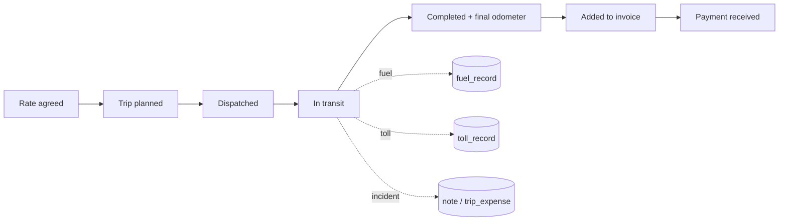
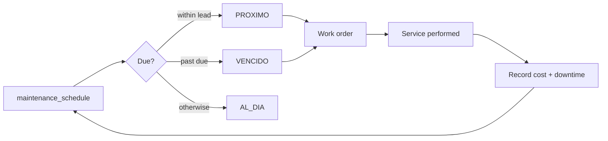

# Discovery — "Cómo cambiar tu negocio de transporte"

**Status:** DRAFT for owner validation. Phase 1 (Discovery). No code, no migrations.
**Owner agent:** `BusinessAnalystAgent`. Financial parts cross-referenced to
[`docs/finance/financial-model.md`](../finance/financial-model.md); entity/ERD parts to
[`docs/database/conceptual-model.md`](../database/conceptual-model.md).

Everything marked **[ASSUMPTION]** must be confirmed by the company owner (see §L).
Nothing here invents facts about the specific company; where a fact is unknown it is
listed in §D and turned into a question in §L.

---

## A. Business analysis

A road-freight company operates a fleet of trucks that haul loads for customers over
routes, earning a freight charge per trip and incurring costs for fuel, tolls, driver
pay, maintenance, tires, insurance, financing/depreciation and administrative overhead.

**Problem.** Operational data (trips, kilometres, fuel, maintenance, downtime) and
financial data (invoices, payments, fixed costs) live in disconnected places — paper,
spreadsheets, fuel receipts, workshop invoices, memory. Nothing ties them together at
the level of a single truck, so **cost per kilometre, profit per trip, and profitability
by customer / route / unit are unknown**. Pricing, contract retention, fleet-replacement
and fleet-expansion decisions are made on intuition.

**Solution.** One system that records the operational and commercial events, computes
the cost and profitability model (see finance doc) for any date range and any grain
(trip, route, customer, truck, fleet), shows it on a dashboard, and lets every number be
traced back to the exact source records that produced it.

### Actors

| Actor | Role in the system |
|---|---|
| Owner / manager | Consumes the dashboard; sets targets; makes pricing & fleet decisions |
| Dispatcher / operations | Registers trips, assigns truck + driver + route, records kilometres |
| Driver | Source of trip data, fuel loads, tolls, incidents, odometer readings |
| Accountant / admin | Invoices, payments, fixed costs, overhead, payroll inputs |
| Workshop / maintenance manager (may be external) | Services, repairs, downtime, parts |
| Data auditor | Verifies that every KPI reconciles to its source records |

### Scope (proposed)

- **In:** fleet cost accounting; trip / route / customer / truck profitability;
  preventive + corrective maintenance with status; fuel & toll capture; fixed &
  variable cost registry; overhead with a documented allocation method; invoicing-lite
  with payment status; KPI dashboard with drill-through.
- **Out (MVP):** full double-entry accounting and tax filing; GPS/telematics
  integration; route optimisation; driver payroll processing; cargo/load marketplace;
  tire retread economics; multi-currency; customer portal.
- **Later phases:** n8n automations (fuel/toll import, maintenance reminders);
  telematics odometer feed; e-invoicing integration; ABC / hybrid overhead allocation.

### Key [ASSUMPTION]s (confirm in §L)

1. Revenue is recognised per trip via a freight charge; pricing basis (flat / per-km /
   per-ton / per-ton-km / negotiated) is **unknown**.
2. One primary driver per trip; occasionally two.
3. Company owns its trucks; some may be financed or leased — capital-cost treatment TBD.
4. Trailers may or may not need to be tracked as separate assets.
5. Single operating currency; VAT/IVA applies to invoices.
6. Odometer is captured at least at trip start/end or at each fuel event.
7. Reporting period is the calendar month.

---

## B. Process map

### B.1 Trip lifecycle

Rate agreed with customer → trip planned (truck + driver + route + date) → dispatched →
in transit (fuel loads, tolls, incidents recorded) → completed (arrival, final
odometer, delivery confirmed) → billed (added to an invoice) → paid.

### B.2 Fuel event

Driver refuels → captures litres, unit price, odometer, station, payment method,
receipt → record linked to the truck and (if known) the trip. Later: bulk import via
n8n from fuel-card statements.

### B.3 Toll event

Toll paid (electronic tag or cash) → amount, location, datetime, payment method →
linked to truck and (if known) trip. Later: import from tag statements via n8n.

### B.4 Preventive maintenance

Schedule per truck (interval by kilometres and/or time and/or engine hours) → system
computes next-due and status (`AL_DIA` / `PROXIMO` / `VENCIDO`) → work order → service
performed by a provider → parts, labour, other cost and downtime recorded → odometer /
date reset on the schedule item.

### B.5 Corrective maintenance

Breakdown / failure reported → truck out of service → repaired by provider → cost and
downtime recorded → truck back in service.

### B.6 Tire management

Tire purchased → mounted on a truck at a position (axle / side) at odometer X →
rotations → dismounted at odometer Y (worn / damaged / sent to retread) → cost per km
per tire computed.

### B.7 Cost registry

- **Truck fixed costs:** recurring per-truck costs (insurance, permits, financing /
  lease, telematics, parking) with an effective period.
- **Overhead:** company-level recurring costs (admin salaries, office rent, management,
  dispatch software) with an effective period and an allocation basis.
- **Ad-hoc truck expense:** wash, minor supplies, fines — date, amount, category.

### B.8 Invoicing & collection

One or more completed trips → invoice to customer → status (draft / sent / paid /
overdue / partial) → payments applied → status recomputed.

### B.9 Period KPI computation

For any date range the system aggregates operational + financial records into the KPI
set (see finance doc §K), renders the dashboard, and keeps every figure drillable to
the source rows.

---

## C. Data we must collect

Summarised here; attribute-level detail is in
[`docs/database/conceptual-model.md`](../database/conceptual-model.md) §H.

- **Truck:** plate, internal number, VIN, make/model/year, configuration, acquisition
  date & cost, acquisition mode (cash/finance/lease) + terms, useful life & residual
  (for depreciation), tank capacity, baseline km/l, current odometer, status, base yard.
- **Driver:** identity, licence class & expiry, hire date, pay scheme, contact, status.
- **Customer:** identity, tax id, credit terms, contact, status.
- **Route:** origin, destination, waypoints, standard km, standard duration, typical
  toll cost, road type, round-trip flag.
- **Trip:** truck, driver(s), route or ad-hoc origin/destination, planned & actual
  dates/times, start & end odometer, loaded weight/volume, cargo type, rate basis &
  agreed price, status, linked invoice, incidents.
- **Fuel record:** truck, trip?, datetime, odometer, litres, unit price, total,
  station, payment method, receipt ref.
- **Toll record:** truck, trip?, datetime, location, amount, payment method.
- **Maintenance:** truck, type, category, provider, entry & completion dates, odometer,
  description, parts / labour / other cost, total, downtime, linked schedule item,
  warranty flag.
- **Maintenance schedule:** truck, task, interval type & value, last performed
  (odometer/date), lead threshold for `PROXIMO`, active flag.
- **Tire:** serial, brand/model, size, purchase date & cost, new tread depth, status,
  current truck & position, mount & dismount odometer, retread count, disposal reason.
- **Truck fixed cost / overhead:** truck (null = company-level), cost type, amount,
  period, effective from/to, allocation basis.
- **Truck expense:** truck, type, date, amount, description, receipt ref.
- **Invoice:** customer, number, issue & due dates, currency, subtotal, tax, total,
  status, linked trips.
- **Payment:** invoice, date, amount, method, reference.
- **User:** identity, role, status.

---

## D. Missing data / open unknowns

These block a correct model. Each becomes a question in §L.

1. **Revenue model** — how a trip is priced; accessorial charges (waiting, extra stops,
   fuel surcharge).
2. **Revenue recognition point** — trip completion vs invoice issued vs payment received.
3. **Fleet size & composition**; whether tractor and trailer are separate assets.
4. **Trailer tracking / costing** — needed or not.
5. **Driver compensation scheme(s)** and whether driver cost is trip-attributable.
6. **Capital cost treatment** — depreciation (method, useful life, residual) vs
   financing payment as proxy.
7. **Overhead** — which costs are per-truck vs company-wide, and monthly totals.
8. **Overhead allocation basis** the owner prefers.
9. **Fuel source** — retail / bulk tank / fuel card; exportability for n8n.
10. **Toll source** — tag statement vs cash; exportability.
11. **Odometer capture** — per trip, per fuel stop, or GPS; reliability.
12. **Maintenance intervals** — defined by km / time / engine hours; source (OEM).
13. **Own workshop vs external shops.**
14. **Individual tire tracking** today — yes/no.
15. **Availability definition** — does planned preventive downtime count as unavailable.
16. **Utilization definition** the owner wants.
17. **Currency, tax rate, invoice numbering, per-customer credit terms.**
18. **Users & roles** — who enters what, who sees what.
19. **Historical data** — what exists, where, how far back to load.
20. **Reporting period** — calendar month or custom.
21. **Pilot scope & target go-live date.**

---

## I. Business rules

Financial formulae are in [`docs/finance/financial-model.md`](../finance/financial-model.md).
Rules here are the operational constraints and derivations.

### Trips & kilometres

- `trip_distance = end_odometer − start_odometer`, must be `> 0`.
- A trip cannot be **completed** without: start & end odometer (or an explicit
  `distance_estimated` flag with a reason), actual end datetime, and an agreed price.
- If odometer is missing, fall back to `route.standard_km` and set `distance_estimated`.
- Flag any trip whose distance deviates from `route.standard_km` by more than a
  configurable tolerance (default **±15%**).
- Odometer readings per truck must be monotonically non-decreasing; anomalies are
  flagged, not silently accepted.

### Maintenance status (per schedule item)

- `VENCIDO` if `current_odometer ≥ next_due_odometer` **or** `today ≥ next_due_date`.
- `PROXIMO` if within `lead_km` of the due odometer **or** `lead_days` of the due date.
- `AL_DIA` otherwise.
- A truck's overall maintenance status is the worst status among its active schedule items.

### Availability & utilization

- `availability(t,P) = (period_days − downtime_days) / period_days`.
- Downtime from **corrective** maintenance always counts.
- Downtime from **preventive** maintenance counts as unavailable **unless the owner
  decides otherwise** — flagged decision (§L Q15).
- `utilization` definition is owner-selected (§L Q16); default proposal
  `revenue_days / available_days`.

### Invoicing & revenue

- `invoice.total = Σ invoice_line + tax`.
- Status is derived: `paid` when `Σ payments ≥ total`; `overdue` when
  `today > due_date` and not paid; `partial` when `0 < Σ payments < total`.
- A trip may appear on exactly one invoice (`invoice_trip` link).
- Revenue for a truck/period is `Σ (trip price)` for trips recognised in the period;
  the recognition point is owner-selected (§L Q2), default **trip completion (accrual)**.

### Cost attribution

- **Direct cost of a trip** = fuel + tolls + trip expenses + per-trip/per-km driver pay
  (if the scheme allows attribution).
- **Truck period cost** = direct costs + truck-specific fixed costs (prorated) +
  capital cost (depreciation *or* financing payment, never both) + allocated overhead.
- Overhead is allocated by the method documented in the finance doc; the chosen method
  and the per-truck weights are **persisted per period** for auditability.
- Tire cost is amortised over `(dismount_odometer − mount_odometer)` or over expected
  tire life while mounted — method documented in the finance doc.

### Data integrity & traceability

- No hard delete of a truck, driver or customer that has historical trips (soft delete).
- Every KPI figure must resolve to the exact set of source-row ids that produced it.
- All monetary values stored as `DECIMAL`; rounding (half-up, 2 dp) only at presentation.
- Lookups (cost types, providers, stations, categories) — no free-text on reportable
  dimensions.
- Every transactional row records `created_by` (user) and timestamps.

---

## L. Questions for the company owner

### Revenue & commercial
1. How do you price a trip today — flat per trip, per km, per ton, per ton-km, or
   negotiated case by case? Any surcharges (fuel, waiting time, extra stops)?
2. When do you consider revenue "earned" — trip completed, invoice issued, or payment
   received?
3. Do you have written rate agreements per customer or per route? Can we get copies?
4. Do you put several trips on one invoice, or one invoice per trip?
5. Typical payment terms per customer (credit days)? How often do invoices go overdue?

### Fleet
6. How many trucks, and of what types / configurations?
7. Are trailers separate assets you'd want tracked and costed on their own?
8. For each truck: owned, financed or leased? For financed/leased, the monthly payment?
9. Do you depreciate trucks? If yes, what useful life and residual value do you assume?
   If no, should we treat the financing payment as the truck's capital cost?
10. Is a truck usually driven by the same driver, or does it change per trip?

### Drivers
11. How are drivers paid — fixed salary, per km, per trip, % of freight, or a mix?
12. Can driver pay be tied to specific trips/trucks, or is it a general cost?

### Costs & overhead
13. List your monthly fixed costs and mark which are **per truck** (insurance, permits,
    GPS, parking) vs **company-wide** (office, admin salaries, management, software).
14. Roughly what does company-wide overhead total per month?
15. When a truck is in the shop, should **planned/preventive** service count against its
    availability, or only **breakdowns**?
16. What does "utilization" mean to you — km per day, days worked vs days available, or
    loaded km vs total km?
17. How would you want overhead split across trucks — by usage (km), by revenue,
    equally per truck, or by activity? (We will recommend one; we want your view.)

### Fuel & tolls
18. Do you buy fuel at retail stations, from a bulk on-site tank, or with fuel cards?
    Are card statements exportable (CSV/Excel)?
19. Tolls: electronic tag with monthly statements, or cash? Exportable?
20. Are odometer readings recorded per trip, per fuel stop, or via GPS?

### Maintenance & tires
21. Do you have preventive maintenance intervals defined (by km, by time, by engine
    hours)? What's the source — manufacturer schedule?
22. Who does the work — your own workshop, external shops, or a mix?
23. Do you track tires individually today (serial, position, km run)?

### Operations, data & rollout
24. What reporting period do you use — calendar month, or something else?
25. What historical data exists and where (spreadsheets, paper)? How far back should we
    load it?
26. Who will use the system, and what should each role be able to see and do?
27. Which trucks should we pilot with first, and what is your target date to go live?
28. Operating currency and tax rate (IVA) for invoices? Any invoice-numbering rules?

---

## M. MVP definition

**Goal.** For a pilot set of trucks over one chosen month, produce trustworthy
cost/km, revenue/km, profit and margin **per truck, per route and per customer**, plus
maintenance status, on one dashboard, with every figure drillable to source records.

### In scope

| Area | MVP content |
|---|---|
| Master data | CRUD for trucks, drivers, customers, routes, cost types, maintenance providers, users/roles |
| Trips | Create / complete trips (odometer, price, route, driver); list & filter |
| Fuel & tolls | Manual entry linked to truck (+ trip) |
| Maintenance | Preventive + corrective events with cost & downtime; per-truck schedule with computed `AL_DIA` / `PROXIMO` / `VENCIDO` |
| Tires | Register + mount/dismount with odometer → cost per km per tire (lite) |
| Costs | Truck fixed costs with effective periods; ad-hoc truck expenses; overhead entry + one allocation method (active-days) with a switch stub |
| Invoicing-lite | Invoice bundling trips; status sent/paid/overdue/partial; payment capture |
| Financial engine | Formulae from the finance doc as a **tested** service; period selector |
| Dashboard | KPI set (finance doc §K) for fleet + per truck, with drill-through to source rows |
| AuthZ | Roles (owner/admin, operations, workshop, read-only) via Policies/Gates |

### Deferred

n8n imports; telematics; e-invoicing; full accounting; route optimisation; customer
portal; ABC / hybrid overhead allocation; multi-currency; tire retread economics;
full invoice line-items & tax breakdown (basic only in MVP).

### Acceptance criteria

- The data auditor can take any dashboard number and reconcile it exactly to the
  listed source rows.
- The financial-formula service has unit tests for **every** metric plus edge cases:
  zero km, missing/estimated odometer, partial payments, cost changes mid-period,
  a truck with no trips in the period.
- `vendor/bin/pint`, `composer types:check` and `php artisan test` all pass in CI.

---

## Next steps (await owner validation before starting)

1. Owner answers §L; update §A–§D and the finance / database docs accordingly.
2. `FinancialAnalystAgent` finalises the cost taxonomy and the overhead-allocation
   decision → `docs/decisions/`.
3. `DataArchitectAgent` turns the conceptual model into a physical ERD + column-level
   data dictionary.
4. Only then: `LaravelArchitectAgent` architecture, then migrations.
