# Conceptual data model — entities, relationships, ERD, data dictionary

**Status:** Updated with owner answers (2026-09-10); proposed entities **approved and
applied** below. **Owner agent:** `DataArchitectAgent`. This is still the
**conceptual** model — the **physical** model (exact column types, indexes,
constraints, migration order) follows once §L.2 in the discovery doc is answered.

Conventions once physical: `bigIncrements` surrogate PK `id`; `foreignId(...)
->constrained()`; money `DECIMAL(15,2)` in CRC; rates `DECIMAL(12,4)`; km
`DECIMAL(10,2)`; UTC timestamps; period ranges as explicit `period_start`/`period_end`
dates (ADR 0003), not `YYYY-MM`; `created_by` (user) on transactional tables; soft
deletes on master data; status/enum values as short lookup tables or `string`, not raw
`ENUM`.

---

## E. Entities

### E.1 From the brief (starting 15) — all retained

`trucks`, `drivers`, `customers`, `routes`, `trips`, `fuel_records`, `toll_records`,
`maintenance`, `maintenance_schedule`, `tires`, `truck_expenses`, `truck_fixed_costs`,
`invoices`, `payments`, `users`.

### E.2 Additions — decided

| Entity | Status | Rationale |
|---|---|---|
| `maintenance_providers` | **Adopted** | All maintenance is external (§L Q22) — every `maintenance` row needs one |
| `cost_types` | **Adopted** | Lookup for truck-fixed costs, overhead costs, expense categories |
| `tire_events` | **Adopted** | Owner tracks position rotations + wear-based replacement (§L Q23) — needs a history, not a single row |
| `rate_agreements` | **Adopted** | Agreements exist but vary (§L Q3) — kept as a *default*, `trips.price` stays authoritative |
| `invoice_trip` | **Adopted** | Invoicing is mixed, bundled or per-trip (§L Q4) — needs a link table |
| `invoice_lines` | **Adopted** | Basic line items for the 13% IVA breakdown |
| `overhead_costs` | **Adopted** | Company-wide costs (salaries, social charges) — currently unmeasured, must be captured (§L Q14) |
| `fixed_cost_allocations` | **Adopted** | Persists the ADR 0001 method + per-truck weight + amount, per period — the audit trail |
| `attachments` | **Adopted** | Receipts / invoice scans, polymorphic — traceability |
| `driver_worklogs` | **Adopted (new)** | Drivers are paid **hourly** for daily hours (§L Q11–12); this is the only way to size the driver-labour share of overhead |
| `fuel_stations` | **Adopted (new)** | Fuel is bought at named retail stations (§L Q18); avoids free-text |
| `odometer_readings` | **Adopted, optional** | Kept for any reading that *is* captured (service visits now; trip/GPS later, ADR 0002) — not required for the system to function |
| ~~`trailers`~~ | **Dropped** | Owner: no trailers exist (§L Q7) |
| ~~`truck_driver_assignments`~~ | **Dropped** | Driver changes per trip, no fixed pairing (§L Q10) |
| ~~`fuel_cards`~~ | **Dropped** | Retail purchases only, no cards (§L Q18) |
| ~~`toll_tags`~~ | **Dropped** | Cash only, no electronic tag (§L Q19) |
| `payment_allocations` | **Adopted (revived)** | Owner confirmed a payment can cover several invoices (§L.2 #9) — see [ADR 0004](../decisions/0004-payment-allocations.md) |

### E.3 Normalization notes

- No free text on any reportable dimension (station, provider, cost type) → lookups.
- `trucks` carries **no** `useful_life_months` / `residual_value` / capital-cost
  fields — depreciation is omitted by the owner (ADR-adjacent decision in the discovery
  doc §A). `acquisition_mode` (owned/financed) is kept for context; financing terms are
  nullable and deliberately unpopulated for now.
- `trips.distance` defaults from `routes.standard_km`; `distance_estimated` flags it
  (ADR 0002). `odometer_readings` is populated opportunistically, not required.
  `trucks.current_odometer` is a **maintained estimate**, re-anchored at each service.
- Period-bound tables (`fixed_cost_allocations`, any future snapshot table) use an
  explicit date range, not a month string (ADR 0003).
- Soft-delete master data so historical trips keep valid references.

---

## F. Relationships

| Parent | | Child | Notes |
|---|---|---|---|
| customer | 1 — ∞ | trips | |
| customer | 1 — ∞ | invoices | |
| customer | 1 — ∞ | rate_agreements | |
| route | 1 — ∞ | trips | `standard_km` required for per-km KPIs (ADR 0002) |
| rate_agreement | 1 — ∞ | trips | optional default; `trips.price` always authoritative |
| truck | 1 — ∞ | trips, fuel_records, toll_records | |
| truck | 1 — ∞ | maintenance, maintenance_schedule | |
| truck | 1 — ∞ | tires *(current)*, truck_expenses, truck_fixed_costs | |
| truck | 1 — ∞ | fixed_cost_allocations | receives its allocated overhead share |
| truck | 1 — ∞ | odometer_readings | optional |
| driver | 1 — ∞ | trips | one driver per trip (§L Q10) |
| driver | 1 — ∞ | driver_worklogs | daily hours → overhead labour pool |
| trip | 1 — ∞ | fuel_records, toll_records, trip_expenses | nullable FK (event may predate the trip link) |
| trip | ∞ — 1 | invoice | via `invoice_trip`; a trip is billed once, an invoice may cover many |
| fuel_station | 1 — ∞ | fuel_records | |
| maintenance_schedule | 1 — ∞ | maintenance | `maintenance.schedule_id` nullable (corrective = null) |
| maintenance_provider | 1 — ∞ | maintenance, tires | all maintenance is external |
| tire | 1 — ∞ | tire_events | mount / rotate / dismount |
| tire_event | ∞ — 1 | truck | position captured on the event |
| invoice | 1 — ∞ | invoice_lines | |
| invoice | ∞ — ∞ | payments | via `payment_allocations` (ADR 0004) — a payment may settle several invoices |
| customer | 1 — ∞ | payments | a payment belongs to the customer, not to one invoice |
| invoice | ∞ — ∞ | trips | via `invoice_trip` |
| overhead_cost | 1 — ∞ | fixed_cost_allocations | per period, per truck |
| cost_type | 1 — ∞ | truck_expenses, truck_fixed_costs, overhead_costs | |
| user | 1 — ∞ | (created_by on transactional tables) | traceability |

No remaining cardinality questions — the last open one (payment ↔ invoice) was
resolved by §L.2 #9 (ADR 0004).

---

## G. Conceptual ERD

```mermaid
erDiagram
  CUSTOMER ||--o{ TRIP : requests
  CUSTOMER ||--o{ INVOICE : billed
  CUSTOMER ||--o{ RATE_AGREEMENT : negotiates
  ROUTE ||--o{ TRIP : standardizes
  RATE_AGREEMENT ||--o{ TRIP : "defaults price for"

  TRUCK ||--o{ TRIP : runs
  DRIVER ||--o{ TRIP : drives
  DRIVER ||--o{ DRIVER_WORKLOG : logs
  USER ||--o{ TRIP : records

  TRIP ||--o{ FUEL_RECORD : has
  TRIP ||--o{ TOLL_RECORD : has
  TRIP ||--o{ TRIP_EXPENSE : has
  TRUCK ||--o{ FUEL_RECORD : consumes
  FUEL_STATION ||--o{ FUEL_RECORD : sells
  TRUCK ||--o{ TOLL_RECORD : pays
  TRUCK ||--o{ ODOMETER_READING : "logs (optional)"

  TRUCK ||--o{ MAINTENANCE : undergoes
  TRUCK ||--o{ MAINTENANCE_SCHEDULE : plans
  MAINTENANCE_SCHEDULE ||--o{ MAINTENANCE : triggers
  MAINTENANCE_PROVIDER ||--o{ MAINTENANCE : performs
  MAINTENANCE_PROVIDER ||--o{ TIRE : supplies
  TRUCK ||--o{ TIRE : "mounts (current)"
  TIRE ||--o{ TIRE_EVENT : "has history"
  TRUCK ||--o{ TIRE_EVENT : "at position"

  TRUCK ||--o{ TRUCK_EXPENSE : incurs
  TRUCK ||--o{ TRUCK_FIXED_COST : carries
  COST_TYPE ||--o{ TRUCK_EXPENSE : classifies
  COST_TYPE ||--o{ TRUCK_FIXED_COST : classifies
  COST_TYPE ||--o{ OVERHEAD_COST : classifies
  OVERHEAD_COST ||--o{ FIXED_COST_ALLOCATION : "spread by (incl. driver labour)"
  TRUCK ||--o{ FIXED_COST_ALLOCATION : receives

  INVOICE ||--o{ INVOICE_TRIP : bundles
  TRIP ||--o{ INVOICE_TRIP : "billed via"
  INVOICE ||--o{ INVOICE_LINE : contains
  CUSTOMERS ||--o{ PAYMENT : pays
  PAYMENT ||--o{ PAYMENT_ALLOCATION : "split into"
  INVOICE ||--o{ PAYMENT_ALLOCATION : "settled by"
```

Groups: **Operations** (truck, driver, driver_worklog, route, trip, fuel_record,
fuel_station, toll_record, odometer_reading) · **Maintenance** (maintenance,
maintenance_schedule, maintenance_provider, tire, tire_event) · **Costs**
(truck_expense, truck_fixed_cost, overhead_cost, fixed_cost_allocation, cost_type) ·
**Commercial** (customer, rate_agreement, invoice, invoice_trip, invoice_line,
payment) · **System** (user, attachment).

No `TRAILER` entity — dropped per owner answer.

---

## H. Conceptual data dictionary

Key attributes only; `*` = required, `?` = nullable/conditional. Types are indicative,
finalised in the physical model once §L.2 is answered.

### trucks `*`
`plate*`, `internal_no`, `vehicle_type*` (`furgon_seco` | `pickup`), `make?`,
`model?`, `year?`, `acquisition_date?`, `acquisition_mode` (owned/financed),
`financing_monthly?` *(not tracked yet — nullable)*, `current_odometer` (km,
**estimate**, ADR 0002), `status` (active/inactive), `base_yard?`.
*No depreciation fields — omitted by the owner.*

### drivers `*`
`name*`, `document_id?`, `license_class?`, `license_expiry?`, `hire_date?`,
`hourly_rate*` (rate), `status`.

### driver_worklogs `*` *(new)*
`driver_id*`, `work_date*`, `hours*` (decimal), `hourly_rate_snapshot*` (rate, copied
at entry so later rate changes don't rewrite history), `computed_pay*` (money,
= hours × rate), `notes?`, `created_by`. Feeds the overhead driver-labour pool
(ADR 0001); **not** linked to a truck (general cost, §L Q12).

### customers `*`
`name*`, `tax_id?`, `credit_days*` (0 / 8 / 15), `contact?`, `status`.

### routes `*`
`name*`, `origin*`, `destination*`, `standard_km*` (**required for per-km KPIs**,
ADR 0002), `typical_toll_cost?` (money), `is_round_trip` (bool).

### rate_agreements `?`
`customer_id*`, `route_id?`, `price*` (money, flat), `valid_from*`, `valid_to?`,
`active` (bool). *Basis is flat-rate only per owner answer.*

### trips `*`
`truck_id*`, `driver_id*`, `route_id*`, `rate_agreement_id?`, `planned_start?`,
`actual_start?`, `actual_end?`, `distance*` (km, defaults to `route.standard_km`),
`distance_estimated*` (bool), `price*` (money, flat), `status`
(planned/dispatched/in_transit/completed/cancelled), `created_by`.

### fuel_records `*`
`truck_id*`, `trip_id?`, `fuel_station_id*`, `occurred_at*`, `liters*` (rate),
`unit_price*` (rate), `total*` (money), `payment_method`, `created_by`.

### fuel_stations `*` *(new)*
`name*`, `location?`.

### toll_records `*`
`truck_id*`, `trip_id?`, `occurred_at*`, `location?`, `amount*` (money),
`payment_method` (default `cash`), `created_by`.

### odometer_readings *(optional, ADR 0002)*
`truck_id*`, `read_at*`, `odometer*` (km), `source` (`maintenance` | `manual`),
`source_id?`.

### maintenance `*`
`truck_id*`, `type*` (preventive/corrective), `cost_type_id?`, `provider_id*`
(always external), `schedule_id?` (null for corrective), `entry_date*`,
`completion_date?`, `odometer?` (km — **re-anchors** `trucks.current_odometer` when
present), `description?`, `parts_cost` (money), `labor_cost` (money), `other_cost`
(money), `total*` (money), `downtime_days?` (counts against availability **only** if
`type = corrective`), `created_by`.

### maintenance_schedule `*`
`truck_id*`, `task_name*` (currently only "Cambio de aceite"), `interval_type*`
(`km`, value pending §L.2 #1), `interval_value?`, `next_due_odometer` (derived from
`trucks.current_odometer` estimate), `lead_km?`, `status` (derived:
AL_DIA/PROXIMO/VENCIDO), `active` (bool).

### tires `*`
`label*` (serial optional/unknown), `status` (mounted/removed/disposed),
`current_truck_id?`, `current_position?`, `purchase_cost?` (money), `provider_id?`.

### tire_events
`tire_id*`, `truck_id?`, `event_type*` (mount/rotate/dismount), `position?`
(e.g. `FL`, `FR`, `RL1`…), `occurred_at*`, `notes?` (e.g. "tread worn").

### maintenance_providers `*` *(new)*
`name*`, `contact?`, `specialty?`.

### cost_types `*` *(new)*
`name*`, `scope*` (`truck_fixed` | `overhead` | `expense`).

### truck_expenses `*`
`truck_id*`, `cost_type_id*`, `expense_date*`, `amount*` (money), `description?`,
`created_by`.

### truck_fixed_costs `*`
`truck_id*`, `cost_type_id*` (seguro/permisos/fumigación/dekra/marchamo),
`amount*` (money), `billing_cycle*` (monthly/quarterly/annual), `effective_from*`,
`effective_to?`. Weekly figure is **derived** by proration (finance doc §J.3), never
stored as the transaction.

### overhead_costs `*` *(new)*
`cost_type_id*` (salarios/salarios_administrativos/cargas_sociales/…), `amount*`
(money), `billing_cycle*`, `effective_from*`, `effective_to?`.

### fixed_cost_allocations `*` *(new)*
`period_start*`, `period_end*`, `truck_id*`, `method*` (worked_days/trips/km),
`weight*` (rate), `amount*` (money). One row per truck per period — the audit trail
behind ADR 0001.

### invoices `*`
`customer_id*`, `number*`, `issue_date*`, `due_date*`, `currency` (default `CRC`),
`subtotal*` (money), `tax*` (money, 13% unless §L.2 #10 says otherwise), `total*`
(money), `status` (draft/sent/paid/overdue/partial), `created_by`.

### invoice_trip
`invoice_id*`, `trip_id*` (unique — a trip appears on one invoice).

### invoice_lines
`invoice_id*`, `description*`, `amount*` (money).

### payments `*`
`customer_id*`, `paid_at*`, `amount*` (money, the full transaction), `method?`,
`reference?`, `created_by`. A payment may settle one or several invoices — see
`payment_allocations` (ADR 0004).

### payment_allocations `*` *(new, ADR 0004)*
`payment_id*`, `invoice_id*`, `amount*` (money — the slice of the payment applied to
this invoice). `Σ amount` across a payment's allocations must not exceed that
payment's `amount`. Unique on `(payment_id, invoice_id)`.

### users `*`
Laravel default + `role*` (`owner_admin` | `admin` | `viewer`; the owner is
`owner_admin`, secretary/wife/son are all `admin`), `status`.

### attachments
`attachable_type*`, `attachable_id*`, `disk`, `path*`, `original_name?`, `mime?`,
`uploaded_by`.

---

## Open modelling decisions

Resolved 2026-09-11 (discovery.md §L.2):

1. ~~Whether `driver_worklogs` needs a truck/trip tag~~ — **No.** Confirmed pure
   overhead, hours logged per driver only.
2. ~~Exact weekly boundary~~ — **Thursday → Wednesday**, confirmed (ADR 0003).
3. ~~Whether payments can span multiple invoices~~ — **Yes.** See
   [ADR 0004](../decisions/0004-payment-allocations.md) — `payments` now records a
   customer payment; `payment_allocations` splits it across one or more invoices.
4. ~~Whether IVA exemptions exist~~ — **No, 13% is universal.**
5. ~~Final role mapping for the secretary / wife / son~~ — **All three are
   `admin`.** `viewer` stays defined but unused for now.

Still open (not blocking):

6. Whether a `truck_period_metrics` snapshot table is worth materialising for
   dashboard speed, or every KPI is computed live with drill-through — defer to the
   architecture phase; not blocking for the ERD.
