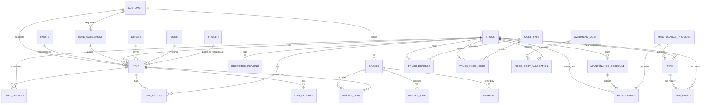

# Conceptual data model — entities, relationships, ERD, data dictionary

**Status:** DRAFT for owner validation. **Owner agent:** `DataArchitectAgent`.
This is the **conceptual** model (entities, relationships, key attributes). The
**physical** model — exact column types, indexes, constraints, migration order — comes
after §L answers are in and this document is validated.

Conventions once physical: `bigIncrements` surrogate PK `id`; `foreignId(...)
->constrained()`; money `DECIMAL(15,2)`; rates `DECIMAL(12,4)`; km `DECIMAL(10,2)`;
UTC timestamps; `created_by` (user) on transactional tables; soft deletes on master
data; status/enum values as short lookup tables or `string` + check, not raw ENUM.

---

## E. Entities

### E.1 From the brief (starting 15)

`trucks`, `drivers`, `customers`, `routes`, `trips`, `fuel_records`, `toll_records`,
`maintenance`, `maintenance_schedule`, `tires`, `truck_expenses`, `truck_fixed_costs`,
`invoices`, `payments`, `users`.

### E.2 Proposed additions (with rationale)

| Entity | Why | Depends on |
|---|---|---|
| `maintenance_providers` | Workshops/vendors referenced by maintenance and tires; stop repeating provider text | — |
| `cost_types` | Lookup for `truck_expenses`, `truck_fixed_costs`, maintenance categories; consistent reporting | — |
| `odometer_readings` | One canonical odometer timeline (fed by trips, fuel, maintenance) so every cost/km denominator is consistent and auditable | — |
| `tire_events` | A tire has a lifecycle (mount → rotate → dismount → retread); one `tires` row can't hold history | tires |
| `rate_agreements` | Contracted price by customer (+ route + basis); drives trip pricing and customer profitability | §L Q1, Q3 |
| `invoice_trip` | An invoice bundles several trips; link table | §L Q4 |
| `invoice_lines` | Line items + tax per invoice (basic in MVP) | §L Q4, Q28 |
| `overhead_costs` | Company-level recurring costs (or model as `truck_fixed_costs` with null `truck_id`) | §L Q13, Q14 |
| `fixed_cost_allocations` | Materialised overhead split per truck per period + method + weight → reproducible KPIs | finance §Allocation |
| `attachments` | Polymorphic receipts / invoice scans → traceability | — |
| **`trailers`** *(conditional)* | Only if tractor & trailer are separate costed assets | §L Q7 |
| **`truck_driver_assignments`** *(conditional)* | Only if a truck has a "usual" driver over time | §L Q10 |
| **`fuel_cards` / `toll_tags`** *(conditional)* | Mapping keys for n8n imports | §L Q18, Q19 |
| **`payment_allocations`** *(conditional)* | Only if one payment can span multiple invoices | §L Q4 |

### E.3 Normalization notes

- No free-text on any reportable dimension (station, provider, category, cost type) →
  lookup tables.
- Derived values (`next_due_*`, totals, cost/km) are computed in the service/query
  layer **or** materialised in a period-snapshot table for dashboard speed — never
  stored as the only copy of a fact.
- `trips.route_id` nullable (ad-hoc trips carry their own origin/destination + distance).
- Soft-delete master data so historical trips keep valid references.
- Audit: rely on `created_by` + timestamps + `attachments`; a full change-log table is
  a later-phase decision.

---

## F. Relationships

| Parent | | Child | Notes |
|---|---|---|---|
| customer | 1 — ∞ | trips | |
| customer | 1 — ∞ | invoices | |
| customer | 1 — ∞ | rate_agreements | |
| route | 1 — ∞ | trips | `trips.route_id` nullable |
| rate_agreement | 1 — ∞ | trips | optional link; else price typed on trip |
| truck | 1 — ∞ | trips, fuel_records, toll_records, odometer_readings | |
| truck | 1 — ∞ | maintenance, maintenance_schedule | |
| truck | 1 — ∞ | tires *(current)*, truck_expenses, truck_fixed_costs | |
| driver | 1 — ∞ | trips | `trips.driver_id`; optional `second_driver_id` (§L Q10) |
| trip | 1 — ∞ | fuel_records, toll_records, trip_expenses | all nullable FK (event may predate trip link) |
| trip | ∞ — 1 | invoice | via `invoice_trip`; a trip is billed once |
| maintenance_schedule | 1 — ∞ | maintenance | `maintenance.schedule_id` nullable (corrective = null) |
| maintenance_provider | 1 — ∞ | maintenance, tires | |
| tire | 1 — ∞ | tire_events | mount / rotate / dismount / retread |
| tire_event | ∞ — 1 | truck | position captured on the event |
| invoice | 1 — ∞ | invoice_lines, payments *(or `payment_allocations`)* | |
| invoice | ∞ — ∞ | trips | via `invoice_trip` |
| overhead_cost | 1 — ∞ | fixed_cost_allocations | per period |
| truck | 1 — ∞ | fixed_cost_allocations | receives allocated overhead |
| cost_type | 1 — ∞ | truck_expenses, truck_fixed_costs | |
| user | 1 — ∞ | (created_by on transactional tables) | traceability |

**Cardinality questions still open:** trip ↔ driver (1 or 2); trip ↔ invoice (1:1 vs
bundle — assumed bundle); payment ↔ invoice (1:∞ vs ∞:∞); trailer existence.

---

## G. Conceptual ERD

Groups: **Operations** (truck, driver, route, trip, fuel_record, toll_record,
odometer_reading, trailer?) · **Maintenance** (maintenance, maintenance_schedule,
maintenance_provider, tire, tire_event) · **Costs** (truck_expense, truck_fixed_cost,
overhead_cost, fixed_cost_allocation, cost_type) · **Commercial** (customer,
rate_agreement, invoice, invoice_trip, invoice_line, payment) · **System** (user,
attachment).

---

## H. Conceptual data dictionary

Key attributes only; `*` = likely required, `?` = conditional/nullable. Types are
indicative, finalised in the physical model.

### trucks `*`
`plate*`, `internal_no`, `vin`, `make`, `model`, `year`, `configuration` (e.g. 6x4),
`acquisition_date`, `acquisition_cost` (money), `acquisition_mode` (cash/finance/lease),
`financing_monthly` (money?), `useful_life_months?`, `residual_value` (money?),
`tank_capacity_l?`, `baseline_km_l?`, `current_odometer` (km), `status`
(active/inactive/sold), `base_yard?`.

### drivers `*`
`name*`, `document_id`, `license_class`, `license_expiry`, `hire_date`, `pay_scheme`
(fixed/per_km/per_trip/pct/mix), `pay_rate` (rate?), `contact`, `status`.

### customers `*`
`name*`, `tax_id`, `credit_days`, `contact`, `billing_address`, `status`.

### routes
`name*`, `origin*`, `destination*`, `waypoints?`, `standard_km` (km), `standard_hours`,
`typical_toll_cost` (money?), `road_type?`, `is_round_trip` (bool).

### rate_agreements `?`
`customer_id*`, `route_id?`, `basis` (flat/per_km/per_ton/per_ton_km/negotiated),
`price` (money) or `rate` (rate), `surcharges?` (json), `valid_from`, `valid_to?`,
`active` (bool).

### trips `*`
`truck_id*`, `driver_id*`, `second_driver_id?`, `route_id?`, `origin?`, `destination?`,
`rate_agreement_id?`, `planned_start`, `planned_end`, `actual_start?`, `actual_end?`,
`start_odometer` (km?), `end_odometer` (km?), `distance` (km, derived/estimated),
`distance_estimated` (bool), `cargo_type?`, `load_weight?`, `price` (money),
`price_basis`, `status` (planned/dispatched/in_transit/completed/cancelled),
`invoice_id?` *(or via invoice_trip)*, `notes?`, `created_by`.

### fuel_records `*`
`truck_id*`, `trip_id?`, `occurred_at*`, `odometer` (km?), `liters` (rate),
`unit_price` (rate), `total` (money*), `station_id?`/`station`, `payment_method`,
`fuel_card_id?`, `receipt_ref?`, `created_by`.

### toll_records `*`
`truck_id*`, `trip_id?`, `occurred_at*`, `location?`, `amount` (money*),
`payment_method`, `toll_tag_id?`, `created_by`.

### odometer_readings
`truck_id*`, `read_at*`, `odometer` (km*), `source` (trip_start/trip_end/fuel/
maintenance/manual), `source_id?`.

### maintenance `*`
`truck_id*`, `type*` (preventive/corrective), `category_id?` (cost_type),
`provider_id?`, `schedule_id?`, `entry_date*`, `completion_date?`, `odometer` (km),
`description`, `parts_cost` (money), `labor_cost` (money), `other_cost` (money),
`total` (money*, = parts+labor+other), `downtime_hours?` / `downtime_days?`,
`is_warranty` (bool), `created_by`.

### maintenance_schedule `*`
`truck_id*`, `task_name*`, `interval_type*` (km/days/engine_hours), `interval_value*`,
`last_done_odometer?`, `last_done_date?`, `next_due_odometer` (derived),
`next_due_date` (derived), `lead_km?`, `lead_days?`, `status` (derived: AL_DIA/PROXIMO/
VENCIDO), `active` (bool).

### tires `*`
`serial*`, `brand`, `model`, `size`, `purchase_date`, `purchase_cost` (money),
`new_tread_mm?`, `provider_id?`, `status` (in_stock/mounted/retread/disposed),
`current_truck_id?`, `current_position?`, `mount_odometer?` (km), `retread_count`
(int), `disposal_reason?`.

### tire_events
`tire_id*`, `truck_id?`, `event_type*` (mount/rotate/dismount/retread/dispose),
`position?` (e.g. `FL`,`FR`,`RL1`…), `odometer?` (km), `occurred_at*`, `cost` (money?),
`notes?`.

### truck_expenses `*`
`truck_id*`, `cost_type_id*`, `expense_date*`, `amount` (money*), `description?`,
`receipt_ref?`, `created_by`.

### truck_fixed_costs `*`
`truck_id*` *(null ⇒ company-level overhead, or use `overhead_costs`)*,
`cost_type_id*`, `amount` (money*), `period` (monthly/annual), `effective_from*`,
`effective_to?`, `allocation_basis?` (only for company-level).

### overhead_costs `?`
`cost_type_id*`, `amount` (money*), `period`, `effective_from*`, `effective_to?`,
`pool?` (dispatch/admin/management/yard — for hybrid allocation).

### fixed_cost_allocations
`period*` (YYYY-MM), `truck_id*`, `overhead_cost_id?`/`pool?`, `method*`
(km/revenue/active_days/direct_cost/hybrid), `weight` (rate*), `amount` (money*).
One row per truck per overhead source per period — the audit trail for allocated cost.

### invoices `*`
`customer_id*`, `number*`, `issue_date*`, `due_date*`, `currency`, `subtotal` (money),
`tax` (money), `total` (money*), `status` (draft/sent/paid/overdue/partial),
`created_by`.

### invoice_trip
`invoice_id*`, `trip_id*` (unique), `amount?` (money — if trip price is split).

### invoice_lines `?`
`invoice_id*`, `description*`, `quantity`, `unit_price` (money), `tax_rate?`,
`amount` (money*).

### payments `*`
`invoice_id*` *(or via `payment_allocations`)*, `paid_at*`, `amount` (money*),
`method`, `reference?`, `created_by`.

### users `*`
Laravel default + `role*` (owner_admin/operations/workshop/read_only), `status`.
Authorization via Policies/Gates keyed on `role`.

### attachments
`attachable_type*`, `attachable_id*`, `disk`, `path*`, `original_name`, `mime`,
`size`, `uploaded_by`.

### trailers `?`
`plate*`, `type`, `axles`, `acquisition_date`, `acquisition_cost` (money),
`status`. Plus `trips.trailer_id?` and its own `maintenance` / `tire` links if adopted.

---

## Open modelling decisions (resolve with §L answers, record in `docs/decisions/`)

1. `trailers` in or out.
2. Driver on a trip: single vs `driver` + `second_driver` vs `trip_driver` link table.
3. Overhead as `truck_fixed_costs.truck_id = null` vs a dedicated `overhead_costs` table.
4. `payments` 1:∞ to invoice vs `payment_allocations` ∞:∞.
5. Whether to materialise a `truck_period_metrics` snapshot table for dashboard speed,
   or compute every KPI live with drill-through.
6. Maintenance cost attribution: by `completion_date` vs day-split accrual across periods.
7. Tire amortisation method (usage-based vs straight-line) as the default.
